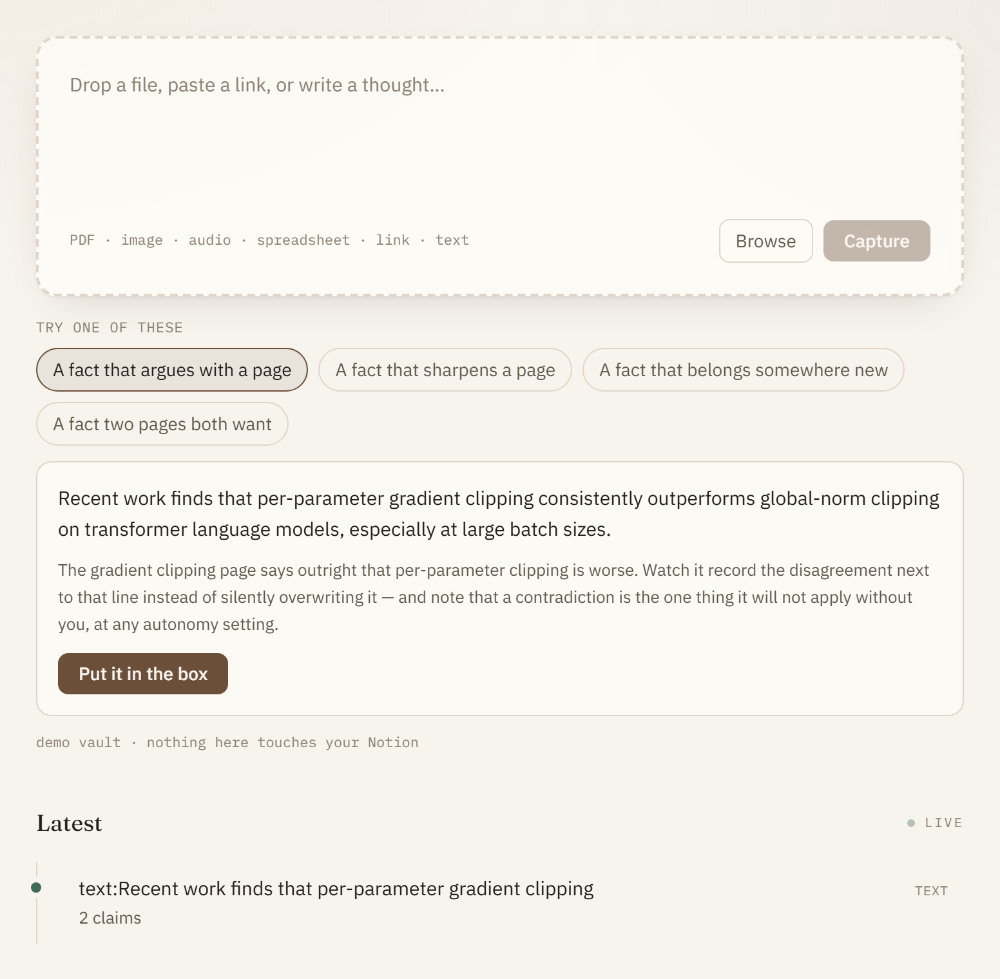
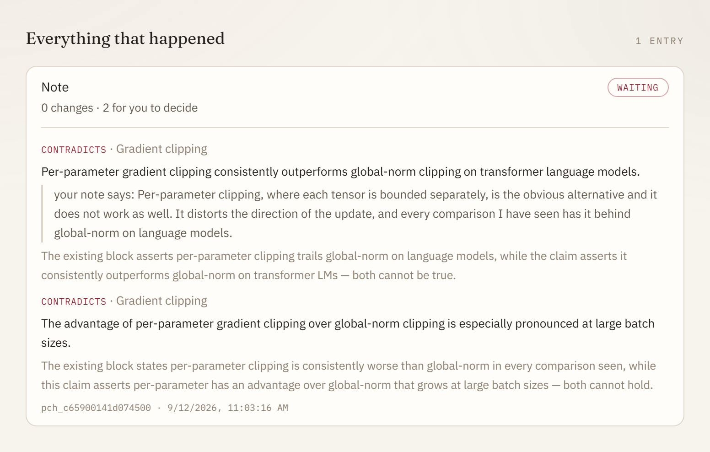

# palimpsest

**A self-maintaining knowledge base — an AI agent that keeps your Notion (or your
Obsidian vault) up to date as you learn.** Give it anything: a URL, a YouTube link, a PDF,
a spreadsheet, a photographed whiteboard, or a sentence you typed. It works out how that
information relates to what you have already written, then makes small, reversible,
fully-cited edits to the right pages — rewriting what changed, striking what is no longer
true, and recording what it disagrees with rather than quietly picking a winner.

> *A palimpsest is a manuscript written over an earlier text, where the earlier writing
> is still visible underneath.* That is the product: your notes get rewritten as you
> learn, and every earlier layer stays readable.

## Try it in thirty seconds

No account, no API key, nothing of yours writable:

```bash
pip install palimpsest-notion
palimpsest demo
```

That opens a sample knowledge base of eight pages and the real app pointed at it. Paste
one of the four suggested facts and watch what happens: one of them argues with a page,
one sharpens a sentence that was vague, one needs a page that does not exist yet, one has
to choose between two pages that both want it. Then open the Activity tab and undo any of
it.

Nothing there is faked. It is the ordinary pipeline — same retrieval, same classifier,
same planner, same single write door, same undo — with the pages stored as markdown in a
temporary folder instead of in your workspace. It uses whatever model you have configured,
falls back to a local [Ollama](https://ollama.com) if you have one, and if it finds
neither it still opens and says so.



Here is what the first of those four produces. The source says per-parameter clipping is
better; the page says the opposite. **It does not pick a winner.** It shows you both,
says why they cannot both be true, and waits — which is the one thing it will not do
without you, at any autonomy setting:



Everything else *is* applied, and every applied change has an Undo next to it.

## Then point it at your own notes

```bash
pip install "palimpsest-notion[all]"
palimpsest serve
```

Or **install the desktop app** from [releases](https://github.com/itsskofficial/palimpsest/releases/latest)
and open it. Either way the setup is the same and happens once: a short wizard asks for
your model and Notion keys, **checks each one on the spot**, and makes the single Notion
page it works inside. Answers go to a config file it reads on every later start, so there
is nothing to edit by hand. Telegram is offered at the end and can be skipped.

Then drop something on the window, and watch what it proposes.

**Two backends.** Notion is the one this was built for. The other is a folder of markdown
files — an Obsidian vault, a git repo, anything you can open with `cat`:

```bash
PALIMPSEST_BACKEND=markdown PALIMPSEST_VAULT=~/vault palimpsest serve
```

Same pipeline, same guarantees. See [Where your notes live](#where-your-notes-live).

Prefer the command line? Everything the bot does is also a command:

```bash
palimpsest setup                      # re-run the wizard any time
palimpsest eval retrieval             # can it find the right page? no key needed
palimpsest eval component             # how good is the classifier, on your model
palimpsest agent "what did I write about attention?"
palimpsest sync                       # mirror your Notion locally
palimpsest sweep duplicates           # what you already wrote twice (no model needed)
palimpsest apply pch_… --reviewer sk  # the only command that writes
palimpsest undo pch_…                 # exactly reversible
```

---

## The problem

You study something and write it up in Notion. Two weeks later you learn more about the
same topic, and now you have to remember which pages touch it, open each one, decide
whether it needs changing, perform the merge without contradicting what past-you wrote,
and remember where it came from.

The deciding step is the one that breaks. It is genuinely ambiguous, it is boring, and
there is always an escape hatch — *make a new page*. Take it fifty times and your
knowledge base is four versions of the same topic, none authoritative.

## The reframe

Everyone who builds this builds "embed the new text, find similar pages, ask a model to
rewrite them." That tool gets abandoned in a week, because rewriting a page is an
unbounded operation and **you cannot review unbounded operations**.

The atom here is not a document. It is a **claim**. And the question is not "update or
create" — it is *how does this claim relate to what I already wrote?*

| Relation | What happens to your notes | Risk |
|---|---|---|
| **`new`** | nothing covers this → append to the best-fitting page, or create one | low |
| **`corroborates`** | already known → **add a citation. No prose is added.** | low |
| **`refines`** | a sharper version of what you have → edit in place, footnote the old wording | medium |
| **`supersedes`** | same fact, newer source → strike the old, add the new, footnote both | medium |
| **`duplicate`** | you wrote this on *another* page → link or merge. Never re-add. | medium |
| **`extends`** | related, but belongs on a different page | medium |
| **`contradicts`** | the source disagrees with the page → the disagreement is *recorded* beside the line, never resolved | high |

Three consequences fall out of that table, and they are the whole design:

**`corroborates` is why the base stops bloating.** Most "new information" about a topic
you already studied is not new — it is the same claim from a different source. Under any
other design that becomes a new paragraph. Here it becomes one small grey marker on a
sentence you already wrote, and *no prose is added at all*.

**`contradicts` is the safety property everything rests on.** A knowledge base that
silently replaces a true claim with a false one is strictly worse than no automation,
because you stop knowing which parts to trust. So the system never decides which of two
sourced claims is true — not at any setting. What the top autonomy level adds is the
*recording* of a disagreement: the competing claim written directly beneath the line it
argues with, both sources cited, the original sentence untouched. One append, one
inverse, one tap to undo. Deciding stays yours.

**Every edit is typed, small, and exactly reversible.** `add_citation`, `update_text`,
`insert_footnote`, `strike_block`, `archive_block`, `create_page`, `link_pages`,
`move_page`, `rename_page`, `set_icon`, `set_cover`, `rewrite_section`. **There is no
delete**: the Notion client has no `DELETE` verb at all, and the most destructive thing
in the vocabulary is a strike-through, which leaves the words on the page.

`rewrite_section` is the one that is not small. It replaces a run of blocks wholesale —
headings, prose, callouts, code, images, columns — because a knowledge base worth reading
needs sections restructured, and no amount of sentence-level editing produces that. It
gives up reviewability-at-a-glance and keeps recoverability: the blocks it replaces are
snapshotted first, so undo restores them exactly, in order. Those are two properties, not
one, and only the first is traded away.

---

## What it does on day one, before it writes anything

`palimpsest sync` pulls your workspace into a local mirror. Then, with **no model and no
API key at all**:

```bash
palimpsest sweep duplicates    # the same content on two different pages
palimpsest sweep questions     # what your base knows it doesn't know
palimpsest sweep stale         # claims that have outlived their topic's half-life
```

`sweep duplicates` is the one to run first. It is the accumulated damage of the last two
years, listed, ranked by similarity, with a suggested merge for each pair. It reads the
mirror and changes nothing.

With a model key you also get `sweep contradictions` — not new-versus-old, but
**old-versus-old**: places where your notes disagree with *themselves*. Your Notion
almost certainly contains some right now, and you do not know which.

---

## Architecture

```
capture → normalise → extract claims → retrieve → classify relation
        → plan patch → review → apply → record provenance
                          ↑                    │
                          └──── learns from ───┘
```

| Layer | What it does | Notable |
|---|---|---|
| `ingest/` | URL, YouTube, PDF, image, CSV/Excel, audio, transcript, raw text → normalised text **+ anchors** | Firecrawl when keyed, stdlib reader when not |
| `jobs.py` | the durable capture queue every surface posts to | a capture survives the window that made it |
| `organise.py` | the *filing*: hubs, moves, renames — proposed, never performed | structural ops, each exactly reversible |
| `extract.py` | text → atomic claims, each with a verbatim quote | claims whose quote isn't in the source are **discarded** |
| `notion/mirror.py` | Notion → local mirror: pages, blocks, backlinks, page *roles* | incremental on `last_edited_time` |
| `retrieve.py` | BM25 + bigrams over the mirror; two separate queries | pure Python, no key needed |
| `relate.py` | the seven-relation classifier | cheap heuristics first, model on the ambiguous middle |
| `plan.py` | relations → typed operations with pre-computed inverses | pure function; fully testable offline |
| `notion/apply.py` | **the only module that writes to Notion** | enforced by an import-linter contract |
| `sweep.py` | duplicates, contradictions, staleness, open questions | three of four need no model |

### Anchors, and why citations don't rot

Every adapter emits *segments* — spans of normalised text with a citable locator. A PDF
anchors to `p. 14`. A YouTube transcript anchors to `1:42:07` **and the footnote links
to that second of the video**. A spreadsheet anchors to `Sheet1!A–D47`.

The extractor maps each claim's character span back to its segment, and the original
bytes are archived on the way in. So a footnote still resolves in two years when the
page 404s. This is the part comparable tools skip, and skipping it is why their
citations are decoration.

### The mirror is not a cache

Notion's API has no diff primitive, no transactions, and no usable version history. So
exact undo, "which source produced this sentence", and time travel are properties of
**our** ledger, not of Notion:

```bash
palimpsest history <page_id>        # every applied change, newest first
palimpsest provenance <block_id>    # source, claim, anchor, who approved it
palimpsest undo <patch_id>          # exact reverse, including partial patches
```

---

## Safety model

Two independent switches, because the failure they prevent is unrecoverable:

```bash
PALIMPSEST_APPLY=0          # default. Nothing is ever written.
PALIMPSEST_AUTONOMY=none    # none | low | medium | full | everything
```

`autonomy` names the highest **risk tier** that may apply without review. `low` covers
`new` and `corroborates`. `medium` adds `refines`, `supersedes`, `duplicate` and
`extends`. `full` is every tier that is automatable at all.

`everything` is the only rung that touches a contradiction, and what it does is narrower
than it sounds: it **records** the disagreement in a callout directly beneath the line it
argues with, citing both sources. It does not decide which one is true — nothing here
ever does, at any setting — and it inverts by removing one block, so a reader who
disagrees with the machine loses nothing by undoing it. "May record the argument" and
"may settle the argument" are different powers, and only the first is on offer.

How sure the classifier must be scales with what the edit would do: **0.60** for a purely
additive block, **0.75** for one that rewrites a sentence, **0.90** for one that changes
what an existing sentence means. `PALIMPSEST_MIN_CONFIDENCE` moves the whole scale.

Beyond that: the applier **writes each operation's inverse before running it** (Notion
has no transactions, so a patch interrupted at operation six must still be reversible),
it **never hard-deletes** (strike-through and restorable trash only), and it **stops at
the first failure** with status `partial` rather than ploughing on.

None of the above is a promise you have to take on trust. The invariants are pinned by
[`tests/unit/test_safety.py`](tests/unit/test_safety.py), which runs offline with no key
in every CI run, and they are written out in [docs/SAFETY.md](docs/SAFETY.md).

---

## Commands

| Command | What it does |
|---|---|
| `palimpsest demo` | the whole thing on a sample vault. No account, no key. |
| `palimpsest sync [--full]` | pull the workspace into the mirror |
| `palimpsest ingest <spec>` | run a source through the pipeline. **Writes nothing.** |
| `palimpsest patches` / `patch <id>` | list / show proposed patches |
| `palimpsest apply <id> --reviewer <you>` | the only command that changes your notes |
| `palimpsest eval leaderboard` | score several models against the golden set |
| `palimpsest undo <id>` | revert exactly |
| `palimpsest sweep <kind>` | `duplicates` · `contradictions` · `stale` · `questions` |
| `palimpsest telegram` | the bot: message it anything |
| `palimpsest organise` | propose a shape for the workspace. **Writes nothing.** |
| `palimpsest serve` | the app on `:8100`, plus the API and the bot |
| `palimpsest history <page_id>` | every applied change to a page |
| `palimpsest provenance <block_id>` | which source produced this text |
| `palimpsest status` | config, mirror size, and anything that looks wrong |
| `palimpsest db check\|migrate\|sql\|reset` | schema management |
| `palimpsest supabase status\|init\|env\|url` | local or cloud Supabase |

## The filing, not just the prose

A knowledge base decays in two independent ways. The prose drifts — which is what the
seven relations fix — and the *filing* drifts: pages pile up at the top level because
creating one there is the path of least resistance, six pages on one subject end up in
five places, half of them are called "Notes".

No amount of editing prose fixes that, because the problem is not inside any page. So
`organise` plans the shape, and emits the same kind of object everything else here
emits — a patch of small typed operations with exact inverses:

```bash
palimpsest organise           # proposes hubs, moves, renames. Writes nothing.
palimpsest apply pch_… --reviewer sk
palimpsest undo pch_…         # the pages go back where they were
```

`move_page`, `rename_page` and `set_icon` invert from the mirror, which already knows
each page's parent, title and icon. There is deliberately no "restructure workspace"
operation, for the same reason there is no `rewrite_page`.

**One thing it refuses to do.** Notion's move endpoint takes a page or a data source and
has no workspace destination, so a page currently at the top level can be filed into a
hub but never moved back out by the API. That operation has no inverse, so palimpsest
will not perform it — such pages become review items explaining the one-way door instead.

## Every change, and why, inside Notion

The ledger that makes `undo` real lives in SQLite, where you cannot see it. But the
question people actually ask — *why does this sentence say that, and who decided?* — gets
asked in Notion, six months later, on a phone. So the ledger is mirrored into two
databases under your root page:

| `palimpsest · Changes` | one row per applied edit |
|---|---|
| `Why` | the classifier's own reasoning for this claim against this block |
| `Relation` | which of the seven produced it, colour-coded by risk |
| `Confidence` | sort by it to find the close calls |
| `Source` · `Cites` | where it came from, and the exact anchor |
| `Approved by` · `Patch` | who said yes, and the id that reverts it |
| `Status` | `Applied` or `Reverted` |

`palimpsest · Sources` is one row per thing you fed it, with how many claims came out
and how many edits landed. Filter Changes to every `supersedes` you ever accepted, or
read one page's history without leaving Notion.

The same reasoning also goes into the footnote on the page itself, next to the sentence
it explains — because nobody runs `palimpsest provenance` on a block.

A journal write can never fail an edit: the row goes in after the operation succeeded,
and its failure is swallowed. Losing a log line is a nuisance; refusing to edit your
notes because the log line failed would be absurd.

## The agent

Talk to your notes. The agent turns palimpsest from a pipeline you feed into something
you converse with — over Telegram, or from the terminal:

```bash
palimpsest agent "what do my notes say about attention scaling?"
palimpsest telegram          # the same agent, on your phone
```

Two things, and only two:

- **Send it anything** — a link, a file, a voice note, a thought — and the knowledge
  base updates.
- **Ask it anything** — and it answers *from your notes*, with page citations.

It has a bounded tool surface (search, read, capture, sweep, organise, apply) and it
**never writes to Notion directly**. Every edit goes through one gate: operations within
your `PALIMPSEST_AUTONOMY` setting apply; everything else is *held* for a tap. The agent
cannot raise its own autonomy, cannot force a held edit through, and cannot apply a
contradiction — those are locked in code, not just asked for in the prompt, and the
guarantees are pinned by [`tests/unit/test_safety.py`](tests/unit/test_safety.py), which
must pass at 100%.

| Layer | What |
|---|---|
| `agent/` | the loop, the 15-tool registry, memory, the system prompt |
| `approval.py` | the one gate every write passes through |
| `evals/` | per-relation precision/recall, weighted so a missed contradiction dominates |
| `trace.py` | Langfuse tracing — every call, no-op without keys |

Measurement, and how autonomy earns its raise:

```bash
palimpsest eval bootstrap    # turn your Approve/Reject history into labelled examples
palimpsest eval component    # per-relation precision & recall against that golden set
```

The golden set is a **test set, not training data** — nothing is fine-tuned. It grows
for free from every approval you make, and it is the number the autonomy ladder is meant
to rest on rather than being set by hand.

## It writes the page, not a list

Feed it a document about something you have never written about and it does not append
eleven bullets in arrival order. The claims go to a composer that lays out a page: an
opening that says what the topic *is*, `heading_2`s that follow the shape of the material,
prose rather than fragments, a callout for the thing that would otherwise be missed, code
where code is clearer than a sentence.

One source produces at most one new page. An earlier version folded page creations by
title, which fixed the obvious duplication and left a subtler one — a single article about
retrieval produced six pages, four of them one sentence long, because every claim carried
a different topic string so no two titles ever collided. Same fragmentation, different
route, and a reader cannot tell the difference.

Two things are checked before a composition is used, because "lay this out nicely" is a
short step from "quietly drop the boring half":

- **Every claim must survive.** The layout is verified against the claims that went in,
  and one that dropped any is discarded — the bullets stand instead. A rewrite may change
  how a page reads; it may not lose a fact.
- **The old version is kept.** Composition rides on `rewrite_section`, so the page before
  is snapshotted and one tap puts it back.

Ask the agent to tidy a page and it uses the same machinery — `rewrite_page` is a tool it
has, gated exactly like the smallest citation.

## Where your notes live

Notion is what this was built for and is still the default. But the whole pipeline talks
to the workspace through **seventeen methods** behind a single write door, so a second
backend is a second implementation of that interface rather than a fork of anything:

```bash
PALIMPSEST_BACKEND=notion                          # the default
PALIMPSEST_BACKEND=markdown PALIMPSEST_VAULT=~/vault
```

A markdown vault is a folder of `.md` files with a small YAML header — an Obsidian vault,
a git repo, plain files you can `grep`. Headings, nested lists, to-dos, code, quotes,
images, and Obsidian's callout syntax for callouts and toggles all round trip byte for
byte, so the tool never rewrites a file it merely read.

The awkward part is block identity. Notion hands out ids; a file has none. So they live in
a sidecar under `.palimpsest/` and are re-aligned against the file on every read — exact
text first, then same-type-nearest-position. **Edit a page in Obsidian while this is
running and the ids survive**, which is what keeps provenance and exact undo true across
an edit the tool did not make.

Three things follow from having a second backend, and each matters more than the feature:

- **You can try the product without risking your notes.** `palimpsest demo` is this
  backend pointed at a sample vault.
- **The write path is testable offline.** Ingest → classify → plan → apply → undo runs
  end to end in CI with no network and no key. It used to be that the only honest test of
  a write was against a live workspace, which meant it mostly did not happen.
- **Your notes are not hostage to one vendor.** A knowledge base you feed for years
  should outlive the app that maintains it.

What a vault does not have is databases, so the activity ledger is a markdown table
instead — which is what a database view is for a reader anyway, and it renders in Obsidian
and on GitHub.

---

## Any model, including none of them

The model is configuration, not code. `PALIMPSEST_MODEL_BASE_URL` points at anything
speaking the OpenAI API; otherwise the provider is inferred from whichever key is set.
Set `PALIMPSEST_MODEL_PROVIDER=ollama` and it runs entirely on your machine — no key, no
cost, nothing leaving the computer, and free embeddings from the same runtime.

That freedom has a price, and the eval is how you see it rather than discover it. Every
model below classified the same twenty labelled cases from the workspace committed at
`src/palimpsest/evals/data/workspace.json`:

```bash
palimpsest eval leaderboard --models anthropic/claude-sonnet-5,ollama/qwen3:8b
```

| model | weighted F1 | contradiction recall | duplicate recall | |
|---|---|---|---|---|
| `anthropic/claude-sonnet-5` | **0.95** | 1.00 | 1.00 | PASS |
| `ollama/qwen3:8b` | 0.57 | 0.67 | 0.00 | fail |
| `groq/openai/gpt-oss-120b` | 0.59 | 0.67 | — | fail |
| `ollama/qwen2.5:7b` | 0.42 | 0.33 | — | fail |
| `ollama/llama3.1:8b` | 0.27 | 0.00 | — | fail |

Local models vary run to run — `qwen3:8b` has scored anywhere from 0.57 to 0.65 on this
set — which is itself worth knowing before you hand one write access.

Contradiction recall is the column to read. A model that misses two contradictions in
three is not a model to hand write access to, whatever its headline number, which is why
that metric is weighted 3× and checked on its own.

So `palimpsest status` refuses to be quiet about it: give write access to a model that
has never been measured, or one that failed, and it says so and names the command.

```bash
palimpsest eval component     # how does *your* model classify?
palimpsest eval retrieval     # can it find the right page? needs no model at all
```

**Embeddings are the opposite story.** Local ones are excellent and cost nothing. On the
same fixture, `mxbai-embed-large` through Ollama takes the two cases that share no
vocabulary at all with their answer — you wrote "the CKA/RSA stuff", the source says
"representational similarity analysis" — from **0% to 100%**, and lifts mean reciprocal
rank on everything else from 0.96 to 1.00. Vectors are cached in the store by block, text
hash and model, so each block is embedded once and an edited one re-embeds by itself.

The honest recommendation, then, is mixed: a good hosted model for the judgement, local
embeddings for the search. Fully local works, and the product will tell you what you gave
up for it.

## The app

The window is the product. Three tabs, and the first one is the whole loop.

**Capture.** A drop zone that takes files, pasted links, pasted text and dragged
selections, above a live feed of everything in flight. The feed is one stream rather than
a queue view and a review view, because "what is happening" and "what needs me" are the
same question asked half a minute apart. A change waiting on you rises to the top in
**rubric red** — the colour medieval scribes used for exactly what the reader must not
skip — and the ones that landed on their own sit below it in aged copper.

Each proposal shows the sentence it wants to write **over the top of the struck-through
line it replaces**, which is the metaphor made literal and also the fastest way to judge
an edit: you can see what you are about to lose. Relation, confidence and the model's
one-line reasoning are on the card. Approve and Reject are the only two buttons.

**Ask.** Questions answered from what you have actually written, with the pages cited.

**Settings.** Keys, grouped by what they buy you and each checked when you paste it, and
above them the two switches that decide whether anything reaches Notion at all — in
plain language, not as `PALIMPSEST_AUTONOMY=medium` buried in a list. Contradictions are
never applied automatically at any setting, and the panel says so where you set it.

The same interface is served three ways from one build: `palimpsest serve` on
`127.0.0.1:8100`, the installable app that wraps it, and the onboarding wizard on first
run. There is no second implementation to drift.

### The installable app

The installer is an Electron shell around that server, so the app and the terminal share
one database, one config file and one set of keys. It does not bundle Python: on first
run it builds a virtualenv under its own data directory and installs `palimpsest-notion`
into it, which keeps the download small and lets the engine be upgraded without
reinstalling the shell.

It also adds the one thing a browser tab cannot: **Ctrl+Shift+Space anywhere**, which
opens a small box over whatever you are doing. Drop a file, paste a link, press Enter —
the box is gone before the ingest starts, because the queue outlives the window.

```bash
cd clients/desktop && npm install && npm run dist   # build the installer yourself
```

On Windows without developer mode, add `-c.win.signAndEditExecutable=false`: the signing
toolchain unpacks symlinks Windows will not create unprivileged. CI builds all three
platforms on tag.

## Telegram, and the browser

Optional, and both thin wrappers over the same queue.

**Telegram** puts capture and approval on your phone. Send the bot a link, a PDF, a voice
note, a screenshot or a paragraph; minutes later it tells you what changed — how many
citations it added on its own, and what it wants you to decide, with the reasoning and
Apply/Reject buttons.

An allowlist is mandatory: a bot token is a bearer credential, so an unpaired chat is
refused. Pairing is done from Settings, where the backend watches for **your** next
message while you are looking at the screen. The bot never accepts an unattended
first-message-wins pairing, because that is a race anyone can win by finding your bot
before you do.

```bash
palimpsest telegram      # or just `palimpsest serve`, which starts it too
# chrome://extensions → Load unpacked → clients/extension
```

The extension sends a YouTube **link** (the server fetches better captions than a page
scrape would), reads the **transcript off the page** on Udemy and Coursera where the
server cannot log in, and sends the **URL** everywhere else. See
[clients/README.md](clients/README.md).

Every surface posts to `POST /v1/jobs` rather than `/v1/ingest`, because ingestion takes
minutes and a popup does not live that long. The queue is durable, so a capture
interrupted by a crash is re-queued rather than lost.

---

## Configuration

Nothing is required to *look*; two keys are required to be useful. See
[`.env.example`](.env.example) for the full list.

| Variable | Needed for |
|---|---|
| `NOTION_TOKEN` | everything that touches Notion |
| `PALIMPSEST_MODEL_PROVIDER` | `anthropic`, `openai`, `groq`, `openrouter`, … or `ollama` to run on this machine with no key |
| `PALIMPSEST_MODEL_BASE_URL` + `PALIMPSEST_MODEL` | anything else that speaks the OpenAI API, including LM Studio and vLLM |
| `PALIMPSEST_EMBED_PROVIDER` / `OPENAI_API_KEY` | optional vectors. `ollama` gives you them free; without any, retrieval is BM25, which is the floor the product is designed around |
| `TELEGRAM_BOT_TOKEN` + `TELEGRAM_ALLOWED_CHATS` | the bot. The allowlist is not optional |
| `ANTHROPIC_API_KEY` | extraction, classification, contradiction sweep |
| `DEEPGRAM_API_KEY` / `GROQ_API_KEY` / `SARVAM_API_KEY` | audio. Any one. **No offline fallback** — a recording fails rather than becoming an empty source |
| `FIRECRAWL_API_KEY` | JavaScript-rendered pages and bot-blocked hosts (falls back to a stdlib reader) |
| `PALIMPSEST_DATABASE_URL` | defaults to `sqlite:///palimpsest.db` |
| `PALIMPSEST_ARTIFACT_URL` | `file://./archive`, `s3://…`, or `supabase://…` |
| `PALIMPSEST_APPLY` / `PALIMPSEST_AUTONOMY` | permission to write |

## Deploying

`docker compose -f deploy/docker-compose.yml up` for the local stack against Supabase, or
`deploy/terraform` for ECS Fargate + ALB + S3 + Secrets Manager in `ap-south-1`. See
[DEPLOYMENT.md](DEPLOYMENT.md).

## Design decisions

[DECISIONS.md](DECISIONS.md) records what was chosen and what was rejected — the claim
atom, the seven relations, why the inverse is written first, why BM25 rather than
embeddings by default, and why there is no `autonomy=high`.

## Licence

Apache-2.0.
